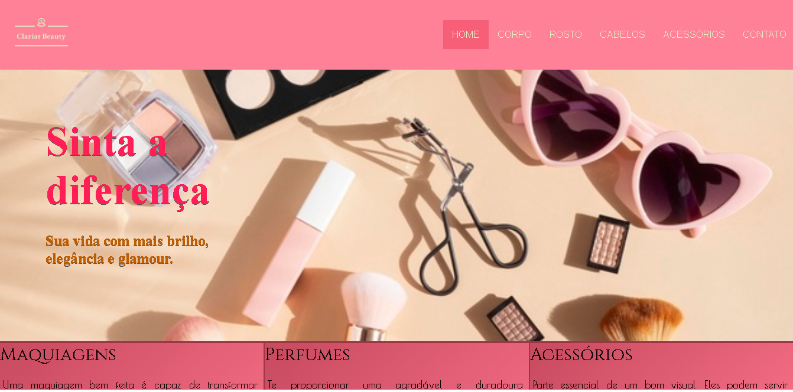
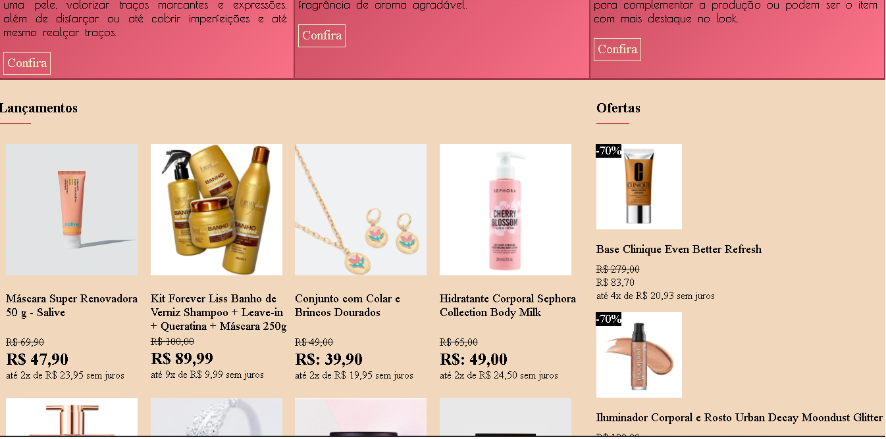
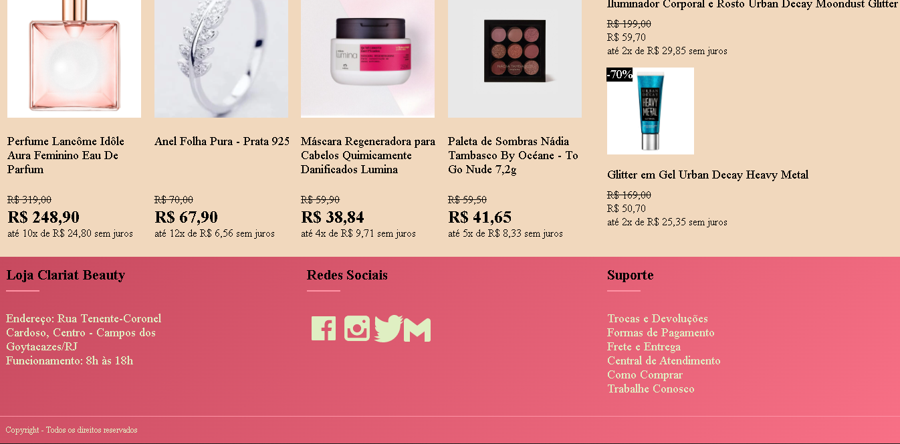

# CosmeticsWebsite
<h3>Este é meu primeiro projeto, usando  HTML e CSS. A finalidade dele é usar só flexbox.</h3>

<h2>Telas do Site</h2> 

  
  
  

Obrigada por sua atenção! &nbsp;&nbsp;&nbsp;

 

(Em breve terão novos projetos).
